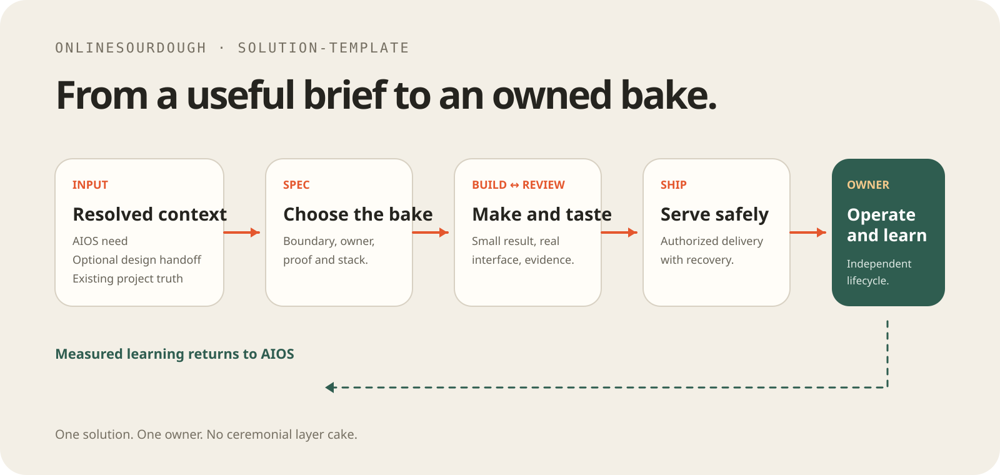

# Solution-template

A small foundation for an application, service, automation, integration,
library, or system that needs its own owner and lifecycle.

```text
intent → technical spec → build ↔ review → ship → owned operation
```

AIOS may supply the business need. Design-template may supply an approved
visual handoff. This repository owns the resulting solution and remains usable
without either one.

## Start

Use an AIOS handoff, Design-template handoff, conversation, brief, existing
README, or change request as context. Then ask:

> Use this context as resolved input. Run `spec-solution`, construct the
> smallest build-ready contract, and build the smallest useful result. Ask one
> question only if a missing decision would materially change it.

`spec-solution` accepts rough ideas, developed briefs, near-complete
specifications, and existing-system changes. It preserves resolved material and
constructs the missing project-local technical specification instead of
demanding a ceremonial document.

## Workflow

| Need | Skill |
| --- | --- |
| Clarify boundaries, proof, contracts, or stack | `.agents/skills/spec-solution/SKILL.md` |
| Implement and verify behavior | `.agents/skills/build-solution/SKILL.md` |
| Review intent, correctness, security, and simplicity | `.agents/skills/review-solution/SKILL.md` |
| Deliver, activate, deploy, or recover | `.agents/skills/ship-solution/SKILL.md` |
| Periodic whole-repository health check | `.agents/skills/audit-solution/SKILL.md` |
| Add a justified specialist skill | `.agents/skills/manage-skills/SKILL.md` |

Build and Review repeat until the requested proof passes. Ship happens only
when the user authorizes the consequential action.

## Inputs and ownership

### From AIOS

Accept resolved outcome, scope, proof, authority, and canonical links. Run a
compact project-local technical Spec, then let this repository own
implementation, operation, recovery, and handover. Bring measured learning
back to AIOS; do not make AIOS a runtime dependency.

### From Design-template

Copy the approved handoff into this repository. Treat its `DESIGN.md`, preview,
assets, and token exports as accepted visual direction, then verify them against
the real product, content, accessibility, and technology. Once copied, this
repository is canonical; Design-template is not introduced as a runtime dependency.

### Standalone

Start from any useful context. The repository owns the full path from intent
through operation. Keep one source for each fact and link rather than duplicate
business truth.

## Technology

Choose technology after the responsibility is understood. Prefer the smallest
stack with a clear owner, observable checks, and a realistic recovery path.
See [TECHNOLOGY.md](TECHNOLOGY.md).

The official Full Stack FastAPI Template is only a sourced option when Python,
React, PostgreSQL, authentication, Docker, and an operated deployment are all
independently justified. It is never the default.

## Repository map

```text
Solution-template
├── AGENTS.md
├── .agents/skills/       # Spec, Build, Review, Ship, Audit, Manage
├── TECHNOLOGY.md         # Small technology decision guide
├── tests/                # Template contract validation
├── assets/               # README illustration
├── CLAUDE.md             # Harness adapter
└── README.md              # Current project truth
```

Validate the template contract with:

```sh
bash tests/validate-spec-solution.sh
```
