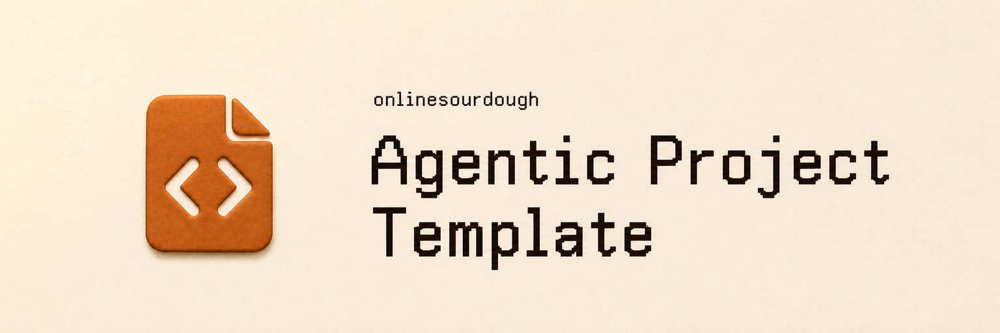
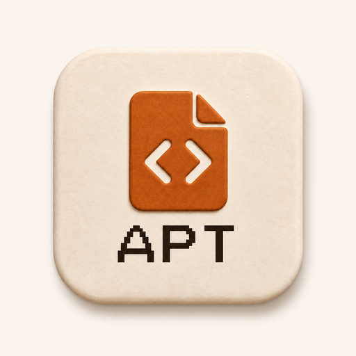

# Agentic Project Template (APT)

[](assets/branding/project-icon.png)

APT is a small optional repository starter for turning an idea into a new
independent project.

## Start

Use the idea, brief or accepted context to establish the outcome and create the
repository at the caller's actual destination. For an existing project, work
in its current repository; do not seed it again.

AIOS supplies context and shared methods. The native harness manages projects,
sessions, tools and installation; APT adds no AIOS Project type or mandatory
registry. The new repository owns its implementation, local requirements,
proof and recovery and runs independently of AIOS and this template.

## Working in the project

Follow local [AGENTS.md](AGENTS.md) and discover the needed shared AIOS method
through the harness. Preserve resolved context and session authority through
implementation, affected checks, review, fixes and authorized delivery. Work
in the current task; delegate only when requested or concretely useful.

Design and content use the shared AIOS skills. Keep working material in
project-local `design/` and `content/` as needed; creation does not pre-create
these directories. Bring in only relevant context and approved assets, and
keep their provenance. The [local skill index](.agents/skills/README.md) is for
repeatable specialist methods owned by this repository.

## Create a repository

From a checked-out APT seed, use the helper with the actual destination and
continue from the returned root:

```sh
bash scripts/create-project.sh /path/to/new-repository \
  --name "Project Name" \
  --outcome "The intended project outcome"
cd /path/to/new-repository
```

The parent directory must exist and the destination must not exist, even as an
empty directory or symlink. `--canonical-url` may identify an existing canonical
location; omitting it declares the new repository canonical. Neither option
sets a Git remote or grants publication authority.

The default `--kind general` creates README, AGENTS, CONTRIBUTING and
docs/README entrypoints without assuming an app or hosting. Explicit
`--kind application` adds ARCHITECTURE, DESIGN, SECURITY and
operations/deployment/infrastructure records. `--kind api` and `--kind cli`
use the same application records with an interface contract in DESIGN.
These foundation records use only the supplied name, outcome, kind and URL.
They state what remains unimplemented and unverified. Later work records the
actual stack, commands, owners, controls, deployment and evidence. Creation
does not select a provider, deploy an app or enable CI.

Both creation routes generate project-specific instructions, a scoped template
license notice, and fresh empty Git history with no remote. The new product's
license is an owner decision. The owner makes the first commit and adds a
canonical remote within granted authority. Only the specialist skill index is
copied; generic AIOS skills remain installed capabilities.
Template assets, tests, scripts, issue state and caches stay behind. An
out-of-place failure removes private staging state and preserves an existing
destination.

### Direct final-root path

When the current task is working at the final project path, fetch the
live canonical APT commit directly into that empty Git repository. Do not
download another seed checkout. Before conversion, verify all of these facts:

- the physical current directory is the exact Git top level and final path;
- `origin` is the sole remote and is
  `https://github.com/onlinesourdough/Agentic-project-template.git`;
- the checked-out branch is `main`, the source default branch is `main`, and
  local `HEAD` equals the freshly queried live `origin/main` SHA;
- the worktree contains no tracked, untracked, or ignored state beyond the
  verified seed; and
- `bash tests/validate-project-template.sh` passes at that exact revision.

Then invoke the APT-owned transition from that root:

```sh
bash scripts/create-project.sh --in-place \
  --name "Project Name" \
  --outcome "The intended project outcome" \
  --source-url "https://github.com/onlinesourdough/Agentic-project-template.git" \
  --source-sha "$(git rev-parse HEAD)"
```

`--source-url` and `--source-sha` are required only for this in-place route and
are recorded as historical provenance, not runtime ownership.

The helper verifies the current root, branch, sole remote, source URL, exact
SHA, and clean state again before generating a private sibling payload. A
pre-transition failure leaves the verified seed untouched. If replacement
fails after the seed moves into recovery position, the helper restores the
verified seed at the same final path. If restoration or cleanup cannot finish,
it reports the exact retained recovery directory instead of claiming success.
Success leaves that final path as the new project with fresh empty Git history,
no remote, the filtered payload, and the verified source URL@SHA in
`README.md` as historical provenance. Because the directory entry is
replaced, the writer must re-enter that exact absolute path before its
post-transition root and Git attestation.

## Instruction discovery

`AGENTS.md` is the maintained instruction source. The seed and generated project
include a `CLAUDE.md` containing only `@AGENTS.md` for Claude Code discovery.
This local import requires no global configuration or copied instruction body.
Shared methods still come from the installed AIOS plugin through native discovery.
If a required method is unavailable, report the gap and continue work adequately
covered by the local contract; do not vendor the shared procedures.

Checked against official documentation on 2026-09-13:
[Codex instruction discovery](https://learn.chatgpt.com/docs/agent-configuration/agents-md)
and [Claude Code imports](https://code.claude.com/docs/en/memory#agentsmd).
Other harnesses need their own supported discovery checked when selected.

## Maintaining APT

The root is the seed. `scripts/create-project.sh` and its sourced
`scripts/foundation-content.sh` own generated instructions and foundation;
changing this README or the seed's AGENTS alone does not change new projects.
Keep local engineering constraints useful and framework-neutral. Shared Spec
owns material scope and technology decisions, including current cost and usage
evidence when it affects the smallest reliable shape. The template provides no
vendor, stack, orchestration runtime or deployment default.

Run the creation contract suite when generation or transfer changes:

```sh
bash tests/validate-project-template.sh
```

It uses disposable local fixtures to verify the payload, source identity,
no-overwrite guards, clean-state checks and recovery. Inspect a generated
project's actual instructions as well; structural checks do not prove agent
behavior, production readiness, CI activation or native model behavior. A
prose-only correction needs only its affected checks.

The [documentation index](docs/README.md) identifies the template's canonical
records. [CONTRIBUTING.md](CONTRIBUTING.md) covers changes to this generator.

The canonical template source is
[onlinesourdough/Agentic-project-template](https://github.com/onlinesourdough/Agentic-project-template).
Shared methods are provided by [AIOS](https://github.com/onlinesourdough/AIOS-Plugin).
