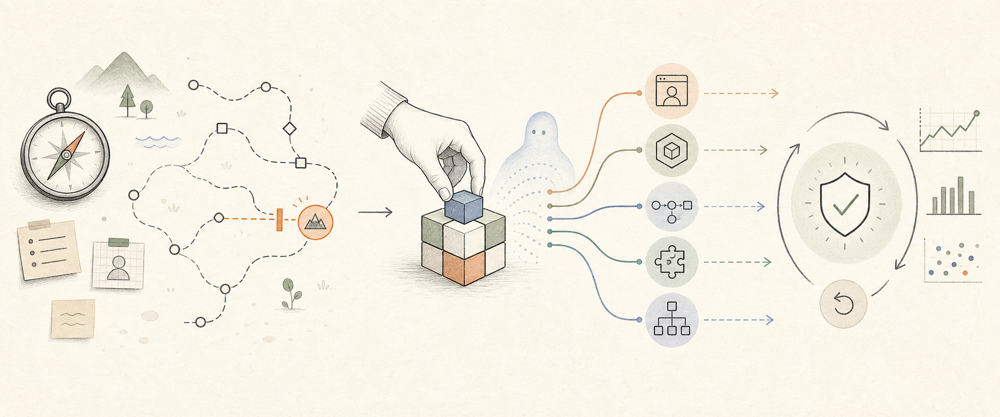

# AI-native Solution Template

Build the smallest technical solution that can create the intended outcome—and
leave it understandable, verifiable, operable, and owned.



The template starts after a real problem or opportunity has been identified.
It helps a person and coding agent turn that context into an **Application,
Service, Automation, Integration, or System** without starting from a framework
or adding capabilities that the solution does not need.

AI-native means that intent, boundaries, contracts, tests, operations, and
recovery are explicit enough for humans and agents to understand and change
safely. Runtime AI is optional.

## AIOS is optional upstream context

AIOS may hold business context, priorities, analysis, and the decision to
build. This repository owns the downstream technical work:

```text
business context or AIOS
  → smallest justified technical intervention
    → separate solution repository
      → architecture, implementation, verification, delivery, and operation
```

There is no shared schema, runtime, handoff contract, or version dependency.
The template also works from a README, issue, meeting, diagram, or direct
conversation.

## Start

1. Create or open the real target repository.
2. Give your coding agent the relevant context.
3. Ask it to use `clarify-solution` if the technical boundary is unclear.
4. Choose one shape and, for an Application, one profile.
5. Apply the template.
6. Build and verify the smallest complete slice.

The clarification skill asks exactly one consequential question at a time. It
stops as soon as outcome, ownership, shape, smallest slice, and acceptance are
clear enough to proceed.

## Choose a shape

| Shape         | This repository owns                             | Examples                                                     |
| ------------- | ------------------------------------------------ | ------------------------------------------------------------ |
| `application` | A human-facing experience                        | Landing page, content library, dashboard, full-stack product |
| `service`     | One bounded capability behind a stable contract  | Calculation API, image renderer, worker                      |
| `automation`  | Trigger and ordered workflow steps               | n8n workflow, scheduled job                                  |
| `integration` | Translation and reliable delivery between owners | Webhook, adapter, proxy, bot boundary                        |
| `system`      | Cross-repository technical truth and operation   | Architecture, infrastructure, ownership, runbooks            |

A mixed design is normal: n8n can own orchestration while a small Service owns
deterministic specialist logic. An agent routine that reasons with AIOS context
remains AIOS work; a separately versioned and operated workflow belongs here.

Only an Application selects a profile:

| Profile             | Use when                                                   |
| ------------------- | ---------------------------------------------------------- |
| `static-pages`      | The output is public static content on GitHub Pages        |
| `cloudflare-native` | The Application uses Cloudflare with optional native state |
| `convex`            | Frontend and Convex backend release as one Application     |
| `external`          | The frontend consumes an independently owned HTTP backend  |

## Apply

Use the runtime's current official scaffold. The applicator adds technical
guidance and workflows; it does not generate framework code or rewrite
manifests.

```sh
git clone --depth 1 https://github.com/gustavonline/solution-template.git

node solution-template/bin/apply-template.mjs \
  --target ./my-solution \
  --shape application \
  --profile static-pages
```

For another shape, omit the profile:

```sh
node solution-template/bin/apply-template.mjs \
  --target ./my-service \
  --shape service
```

Options:

```text
--target <path>
--shape <application|service|automation|integration|system>
--profile <static-pages|cloudflare-native|convex|external>
--dry-run
--force
```

The target needs one recognizable project marker such as `.git`,
`package.json`, `pyproject.toml`, `requirements.txt`, `go.mod`, or
`Cargo.toml`. Applications also need `package.json`.

Every target receives `AGENTS.md`, the focused project skills, its shape guide,
and `.solution-template.json`. Applications also receive one profile, CI, and
an honest deployment workflow where a common path exists. Other shapes receive
no invented universal runtime.

## Focused project skills

Use natural language or start broad with `develop-solution`. Load only the
specialist needed for the current task.

| Skill                | Responsibility                                               |
| -------------------- | ------------------------------------------------------------ |
| `clarify-solution`   | Outcome, scope, ownership, shape, profile, acceptance        |
| `architect-solution` | Boundaries, stack, data, REST/API contracts, decisions       |
| `test-solution`      | Risk-based TDD, regression, contracts, real-runtime evidence |
| `implement-slice`    | One minimal complete vertical slice                          |
| `secure-solution`    | Trust, identity, secrets, privacy, supply chain, runtime AI  |
| `document-solution`  | README, ADR, OpenAPI, diagrams, runbooks, handover           |
| `review-solution`    | Code review and evidence-based technical readiness           |
| `deliver-solution`   | CI, release, migration, deployment, activation, rollback     |
| `operate-solution`   | Logs, health, metrics, resilience, incidents, recovery       |
| `develop-solution`   | Routes broad work through the smallest relevant set          |

TypeScript is the default for web-oriented solutions and integrations when it
fits; Python is a first-class choice for data, image, scientific, ML, or
existing Python workloads. Current ownership and operator capability outrank
either default.

## Deliberately absent

The template adds no database, auth, billing, queue, container, analytics
platform, runtime AI, or distributed architecture by default. GitHub Pages is
only for public output; paid or private access must be enforced by a trusted
server-side owner.

`v0.5.0` is a public preview. See [CONTRIBUTING.md](CONTRIBUTING.md),
[SECURITY.md](SECURITY.md), and [CHANGELOG.md](CHANGELOG.md).

MIT licensed. Built by Arc'IT and available through Online Sourdough Resources.
