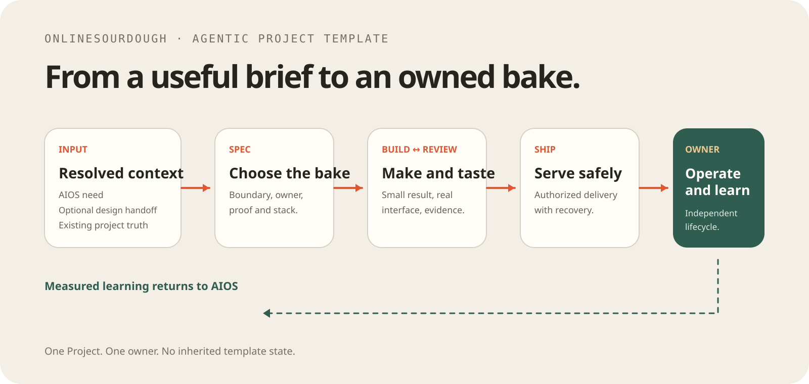

# Agentic Project Template (APT)

A small, directly copyable foundation for an application, service, automation,
integration, library, or system that needs its own owner and lifecycle.

APT is a Project Template, not a persistent Agentic System. The ownership
transfer is the important behavior:

```text
resolved context
→ copy/use APT
→ projects/<name>/
→ the new Project owns its instructions, skills, implementation, proof,
  recovery, and lifecycle
```

After creation, the Project is canonical. AIOS, a Design System, and this seed
may supply context, but the Project works without them at runtime and retains
no competing template identity or state.

```text
intent → project-local spec → build ↔ review → authorized ship → owned result
```

## Start

Use an AIOS handoff, Design System handoff, conversation, brief, existing
README, or change request as context. Then ask:

> Use this context as resolved input. Run `spec-project`, construct the
> smallest build-ready contract, and build the smallest useful result. Ask one
> question only if a missing decision would materially change it.

`spec-project` accepts rough ideas, developed briefs, near-complete
specifications, and existing-system changes. It preserves resolved material
and constructs the missing project-local technical specification instead of
demanding a ceremonial document.

## Workflow

| Need | Skill |
| --- | --- |
| Clarify boundaries, proof, or contracts | `.agents/skills/spec-project/SKILL.md` |
| Choose a new or materially changed technology | `.agents/skills/choose-technology/SKILL.md` |
| Implement and verify behavior | `.agents/skills/build-project/SKILL.md` |
| Review intent, correctness, security, and simplicity | `.agents/skills/review-project/SKILL.md` |
| Deliver, activate, deploy, or recover | `.agents/skills/ship-project/SKILL.md` |
| Periodic whole-repository health check | `.agents/skills/audit-project/SKILL.md` |
| Add a justified specialist skill | `.agents/skills/manage-skills/SKILL.md` |

Build and Review repeat until the requested proof passes. Ship happens only
when the owner authorizes the consequential action.

## Inputs and boundaries

### From AIOS

AIOS can supply resolved outcome, scope, proof, authority, and canonical links.
The Project runs a compact project-local Spec, then owns implementation,
operation, recovery, and handover. Measured learning can return to AIOS; AIOS
is not a runtime dependency.

### From a Design System

Copy an approved handoff as ordinary resolved input and verify it against the
real product, content, accessibility, and technology. Do not require a
maintained Design↔Project schema or make the Design System a runtime dependency.

### Standalone

Start from any useful context. The created Project owns the full path from
intent through operation. Keep one source for each fact and link rather than
duplicate business truth.

Canonical adjacent repositories, when their context is relevant, are
[AIOS](https://github.com/onlinesourdough/AIOS-template),
[Agentic Design System (`Design-template`)](https://github.com/onlinesourdough/Design-template), and
[Agentic Content System](https://github.com/onlinesourdough/Agentic-Content-System).
They are optional context sources, not runtime dependencies.

The authorized Ship target is
[onlinesourdough/Agentic-project-template](https://github.com/onlinesourdough/Agentic-project-template).
Renaming the GitHub repository or changing remotes is an authorized Ship action,
not part of this Build.

## Create an owned Project

The root is the seed; do not introduce a nested `template/` directory.

### AIOS path

From the AIOS workspace, create directly under `projects/<name>` and continue
from the returned Project root:

```sh
bash /path/to/agentic-project-template/scripts/create-project.sh \
  /path/to/AIOS/projects/<name> \
  --name "Project Name" \
  --outcome "The intended Project outcome"
```

AIOS hands off resolved context, then the new Project owns `AGENTS.md`, local
skills, implementation, proof, recovery, and lifecycle.

### Standalone path

From a checked-out APT seed, run the same helper and then work only from the
new root:

```sh
bash scripts/create-project.sh ../<name> \
  --name "Project Name" \
  --outcome "The intended Project outcome" \
  --canonical-url "https://example.com/projects/<name>"
cd ../<name>
```

The helper initializes fresh empty Git history, does not inherit an origin
remote, and leaves the first commit to the Project owner. It copies only
Project-local skills and the license; it generates new Project instructions,
README, ownership, proof, and recovery notes. Template-only assets, tests,
creation scripts, issue references, caches, and generated state are not copied.
`CLAUDE.md` is intentionally not generated; the Project uses its own
`AGENTS.md` as its root instruction contract.

See [the creation contract](docs/creation.md) for the exact transfer behavior.

## Technology

Keep an existing working stack when the change does not materially alter it,
record it in the Spec, and go directly to Build. For a new or materially
changed technology decision, use
`.agents/skills/choose-technology/SKILL.md` after the project-local contract is
ready. Its conditional Full Stack FastAPI reference loads only when its fit
gates may be independently satisfied. If a concrete specialist capability is
missing, route it through `.agents/skills/manage-skills/SKILL.md`; do not
preload or install stack-specific skills from this template.

When usage or cost can change the smallest reliable result, the technology
decision records a dated check of current official terms, a bounded usage
guardrail, and the operator's stop condition. It does not retain a price table
or recommend a provider. An existing workflow runtime, including n8n, may own
visible triggers, integrations, approvals, schedules, and bounded retries when
those responsibilities justify it. It is never a template dependency; see the
[optional orchestration tracer](.agents/skills/choose-technology/examples/optional-n8n-boundary-tracer/README.md)
for a sanitized, local-only decision and replay example.

## Repository map

```text
Agentic-project-template
├── AGENTS.md
├── README.md
├── .agents/skills/       # Project lifecycle skills and technology choice
├── docs/                 # Creation and ownership contract
├── scripts/              # Direct Project creation helper
├── tests/                # Template contract and creation validation
└── assets/               # Documentation illustration
```

Validate the template and creation contract with:

```sh
bash tests/validate-project-template.sh
```

The GitHub repository rename and any remote/settings change are Ship actions;
they are intentionally not performed by this Build.
